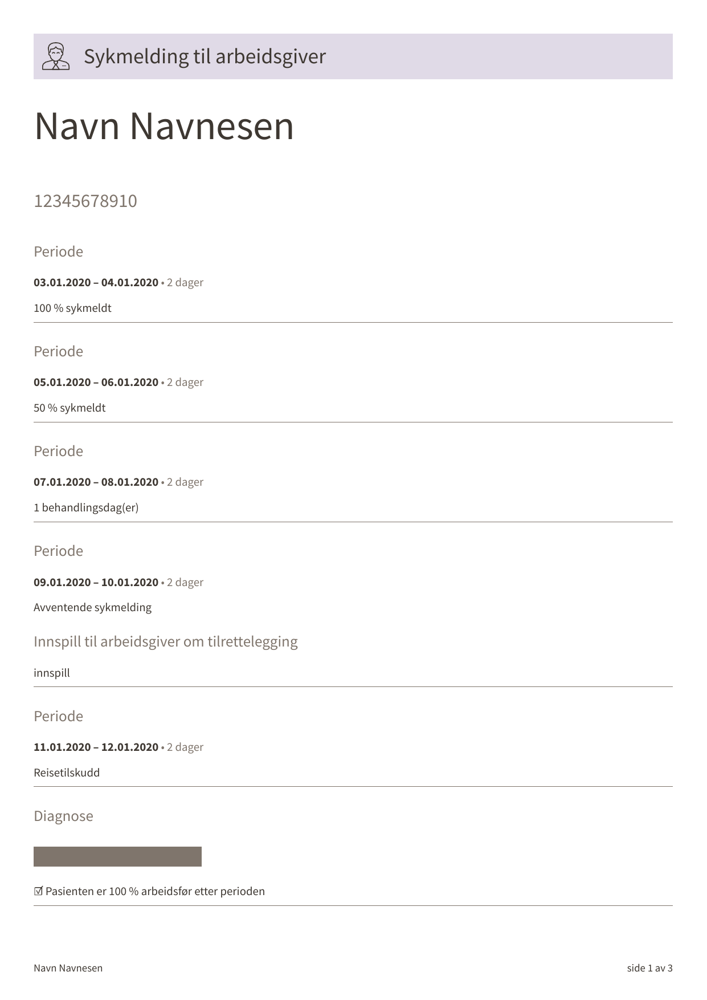
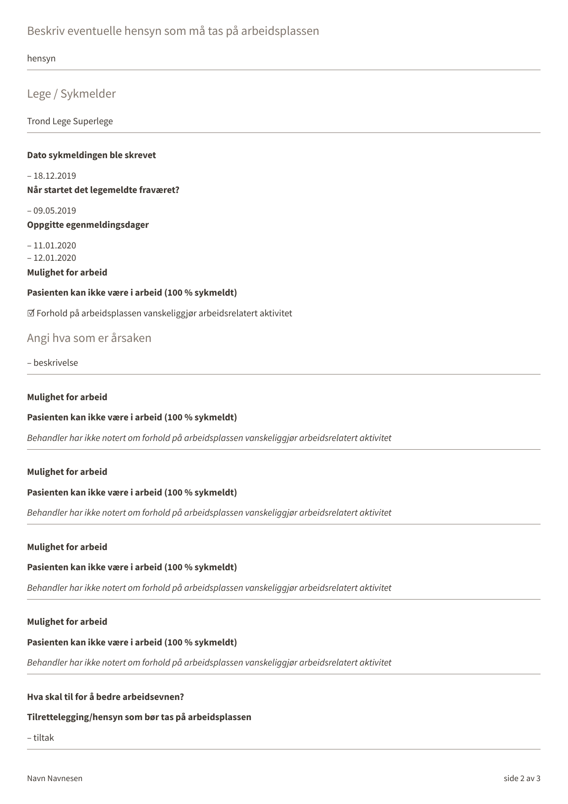
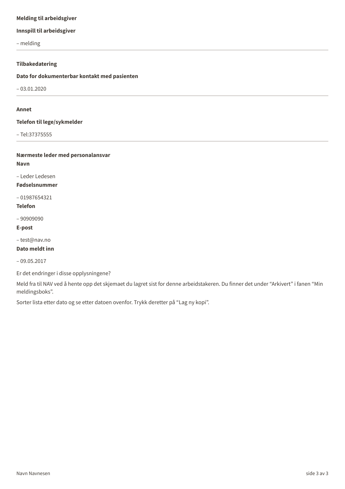

# syfosmaltinn
[](https://github.com/navikt/syfosmaltinn/actions/workflows/deploy.yml)

This project contains the application code and infrastructure for syfosmaltinn

## Technologies used
* Kotlin
* Ktor
* Gradle
* Junit

### :scroll: Prerequisites
* JDK 21
  Make sure you have the Java JDK 21 installed
  You can check which version you have installed using this command:
``` shell
java -version
```

* Docker
  Make sure you have the Docker installed
  You can check which version you have installed using this command:
``` shell
docker -version
```

## Getting started
### Building the application
#### Compile and package application
To build locally and run the integration tests you can simply run
``` bash
./gradlew shadowJar
``` 
or  on windows 
`gradlew.bat shadowJar`

### Upgrading the gradle wrapper

Find the newest version of gradle here: https://gradle.org/releases/ Then run this command:

``` bash
./gradlew wrapper --gradle-version $gradleVersjon
```

### Local development pdf with JetBrains IDE

When editing the Typst template (`typst-pdf/smarbeidsgiver.typ`) in a JetBrains IDE (IntelliJ IDEA, Rider, etc.), install the [Typst Pro](https://plugins.jetbrains.com/plugin/30231-typst-pro) plugin to get a full editing experience:

1. Open **Settings / Preferences → Plugins → Marketplace**, search for **Typst Pro** and install it (or install it directly from the [JetBrains Marketplace](https://plugins.jetbrains.com/plugin/30231-typst-pro)).
2. Restart the IDE. The required [Tinymist](https://github.com/Myriad-Dreamin/tinymist) language server is downloaded automatically on first use.
3. Open `typst-pdf/smarbeidsgiver.typ`. You will get:
   - Syntax highlighting and code completion
   - Inline error diagnostics and quick-fixes
   - A **live preview** panel (open it with the preview icon in the editor toolbar) that re-renders the document as you type, with bidirectional scroll sync
4. To render the template locally with repository test data, run:
```bash
typst compile --pdf-standard=a-2a --font-path=typst-pdf/fonts --input=data="$(cat typst-pdf/test-data/smarbeidsgiver.json)" typst-pdf/smarbeidsgiver.typ smarbeidsgiver-local.pdf
```

### Example PDF output

[pdf](smarbeidsgiver.pdf)

[](smarbeidsgiver-1.png)
[](smarbeidsgiver-2.png)
[](smarbeidsgiver-3.png)

### Contact

This project is maintained by navikt/teamsykmelding

Questions and/or feature requests? Please create an [issue](https://github.com/navikt/syfosmaltinn/issues)

If you work in [@navikt](https://github.com/navikt) you can reach us at the Slack
channel [#team-sykmelding](https://nav-it.slack.com/archives/CMA3XV997)
